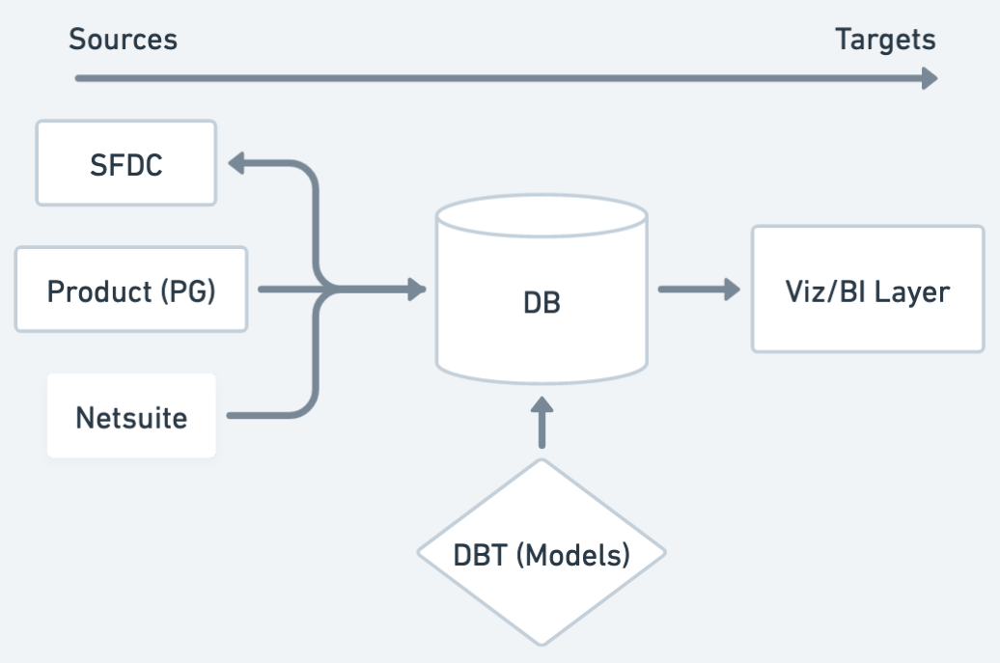

# Maca Take Home Technical Screener

## Overview



This is a generalized diagram of how data moves from a source to a target. I think of sources as the backend and targets as the frontend. Sources can be all types of third-party SaaS companies, internal product databases, or event streams. Targets can be machine learning algorithms or visualization tools. This is also where you find job specialization with data engineers focused on source data ingestion and data analysts/ml engineers focused on target data systems. I am going to focus 90% of this exercise on the target data systems. If this exercise were for a later stage company, then I would probably focus more on the source data ingestion. My reasoning for this is that all of the source data ingestion architecture is almost worthless in terms of creating value. It isn't a competitive advantage. All companies more or less do this the same. It largely impacts reliability and scalability, but you don't have those problems unless you create something of value as a target for all of these data ingestion pipelines. Therefore, I want to focus on the value creation portion for this exercise.

## What am I going to build?

I am going to build an example of how I think about exploratory data analysis in the context of salesforce opportunities. During my chat with Danielle she mentioned that company stage (i.e. series A, etc) has an impact on which companies Maca targets internally. I am going to build a toy data pipeline to improvise on this question. Does company size, either in revenue or employee count, impact winning opportunities? Of course, there will be no substance to this data since it is random, but I hope it gives some ideas of how I approach data problems and how I think about data pipelines.

For this exercise, I used a Postgres + DBT + Python stack. Disclaimer: There are proabably >1,000 ways to do this. I have no strong allegiances to any technology as long as it helps me solve problems. This particular stack just indicates some things that I have found useful in the past. Here is what each piece of the stack does:

- Postgres - Simple database to store the data. We [load the source data to Postgres](./docker/postgres/init.sql) and then store aggregates for consumption by python for analysis.

- DBT - Add SQL modeling as a build step. This tool allows us to express data transformations and tests as SQL statements. In this particular example we are creating [an aggregate table](./docker/dbt/models/agg_salesforce_duns_eda.sql) to combine `salesforce_accounts` and `duns and bradstreet` data. We are also declaring [3 data tests](./docker/dbt/tests/) to ensure the data is populated the way we expect. 

- Python + Jupyter - This is an interactive tool that data analysts and ML folks use to explore data. __This isn't meant to be deployed to production.__ I am using this to explore the data and answer the question of whether company size impacts winning opportunities. I am using [pandas](https://pandas.pydata.org/) to load the data from Postgres and then do some basic analysis. I am using [matplotlib](https://matplotlib.org/) to visualize the data.

I produced some examples of the types of questions I would ask, as well as the way I would answer some of these questions. You can see a detailed write-up [here](./docs/analysis.md).

### How to run this project locally?

#### Prerequisites

- [Docker](https://docs.docker.com/desktop/install/mac-install/)

#### Steps

1. Start the services and check the logs

```bash
# Start all the services
docker compose up -d

# Check the DBT container logs
docker logs $(docker ps -a -f ancestor=dbt --format "{{.ID}}")
```

2. Connect to Jupyter notebook by visiting [http://localhost:8888](http://localhost:8888/lab/tree/work/salesforce_opportunities.ipynb)

### What would I focus on with more time?

- Data interchange. I didn't programmatically download the data or do any type of checking prior to loading it to Postgres. Something that would be valuable is a static typing gate of all data entering our services. Tools like protobuf + gRPC is really helpful for providing contract interfaces in a service mesh. 
- Visualization Framework. I would also add a more permenant data visualization tool like Superset or Looker. For this example, I just generated a local exploratory chart. If we wanted to empower other people in the business to explore data, then we would need a more robust tool.

### How long did this take me?

I spent roughly 8 hours on this exercise. I spent most of that time thiking about what I was going to build.

## References

- [Decision Log](./docs/decision-log.md)
- [Analysis](./docs/analysis.md)
