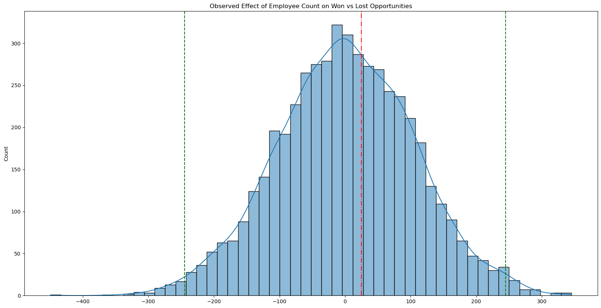

# Analysis

Does the number of Employees in a company impact winning or losing the business opportunity?

Before we build anything long-lasting in data, we always want to know two things...

1. What does the data say about the world?
2. Is what the data say about the world meaningful?

Those are hard questions that humans have struggled with for hundreds of years. We are searching for a way to determine truth. We want to build data products that provide meaningful insights into complicated processes. There are some tools that can help us do that. In this toy example, I used a method called [permutation testing](https://en.wikipedia.org/wiki/Permutation_test). This gif shows how it works.

If you remember your statistics 101 class in undergrad, you probably remember looking up t-values in an appendix to compare two samples of data. These methods were created a long time ago by people that were comparing samples of data with dozens or hundreds of observations. In the modern world, we have access to much more data. We can use that data to create a distribution of possible outcomes. We can then compare our observed outcome to that distribution to determine how likely it is that our observed outcome is due to chance.

You can see the results of our permutations test below. 

Our observed mean is represented by the red line. The green lines represent the P99 bounds of the resampled universe of all possible outcomes. In this case, our observed mean is almost certainly due to random chance and employee count has no singular impact on winning or losing a business opportunity.